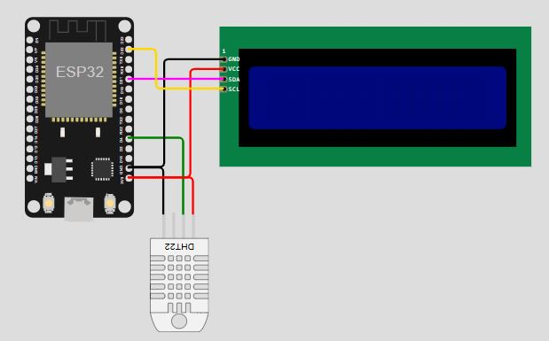

<p align="center">
  
</p>

# SafeNet AI – Sistema Inteligente de Monitoramento de Desastres Naturais 

## Visão Geral

O **SafeNet AI** é uma solução inteligente que utiliza sensores embarcados com **ESP32** e o poder da **Inteligência Artificial** para monitorar, prever e alertar sobre desastres naturais. Ao integrar **hardware de baixo custo**, **servidores em nuvem** e um **dashboard interativo**, o sistema visa proteger vidas e otimizar respostas emergenciais.

📡 **Sensores conectados** → ☁️ **Análise com IA na Azure** → 📊 **Visualização em tempo real via Streamlit**

---

## Objetivos

- Monitorar condições ambientais críticas (chuvas intensas, calor extremo, vibrações sísmicas, etc).
- Aplicar modelos de IA para prever eventos como enchentes, incêndios e terremotos.
- Enviar alertas antecipados com base em dados preditivos.
- Facilitar a tomada de decisões por meio de um painel web intuitivo.
- Reduzir custos com uma arquitetura baseada em **ESP32**, **cloud computing** e **open source**.

---

## Arquitetura do Projeto

### 🔧 1. ESP32 Firmware (Wokwi)
- Simulação de sensores: temperatura, umidade, pressão e vibração.
- Armazenamento local de dados críticos.
- Transmissão dos dados via Wi-Fi para a nuvem.

### ☁️ 2. Servidor Azure + IA
- Recebe dados dos dispositivos em tempo real.
- Processamento com **modelos preditivos (ML/LLM)**.
- Armazenamento e categorização dos alertas em banco de dados na nuvem.
- Resposta em tempo real para o frontend.

### 💻 3. Dashboard Interativo (Streamlit)
- Interface leve e acessível para visualização.
- Módulos:
  - Painel de dados em tempo real
  - Previsões geradas por IA
  - Histórico de alertas e eventos
- Acesso via desktop ou mobile (responsivo).

---

## 🌐 Acesso ao Dashboard Streamlit

Acesse o painel de visualização em tempo real:

🔗 [http://trabalhogs.westus3.cloudapp.azure.com:8502/](http://trabalhogs.westus3.cloudapp.azure.com:8502/)


Este painel exibe:
- Leituras dos sensores (temperatura, umidade, movimento)
- Gráficos em tempo real
- Análises fornecidas pela IA via Azure
  
---  

#### Simulação no Wokwi

Você pode testar a simulação do circuito ESP32 com DHT22 clicando no link abaixo:

[Simulação Wokwi - ESP32 com DHT22](https://wokwi.com/projects/433056338440521729)

### 🖼️ Diagrama do Circuito  


---

⚙️ Lógica do Código ESP32

O código C++ foi desenvolvido para simular um sistema de monitoramento de desastres naturais com base em sensores conectados ao ESP32.

**Principais funções:**

- **Leitura dos sensores:** O sensor DHT22 coleta temperatura e umidade do ambiente, enquanto o sensor de vibração simula tremores sísmicos.
- **Ação sobre o relé virtual:** Um relé é acionado automaticamente quando os dados indicam condições críticas, como:
  - Temperatura > 35°C
  - Vibração detectada
  - Umidade acima ou abaixo de limiares pré-definidos
    
---

📁 Justificativa da Estrutura do Banco de Dados (MER)

A estrutura do banco de dados foi baseada no Modelo Entidade-Relacionamento (MER) construído na Fase 2, com o objetivo de organizar e relacionar eficientemente os dados captados pelos sensores.

- A tabela `sensor` armazena o tipo e unidade de cada sensor.
- A tabela `localizacao` identifica a origem das leituras.
- A tabela `leitura_sensor` guarda os dados captados, ligados ao sensor e ao local.
- A tabela `alerta` registra os eventos críticos gerados com base nas leituras.

Essa estrutura permite rastrear eventos ambientais em tempo real, realizar análises históricas e alimentar modelos de IA. A modelagem também facilita a realização de operações CRUD e garante flexibilidade para futuras expansões do sistema.

---

📊 Tabelas de Exemplo com Dados Simulados

**Tabela: sensor**

| id_sensor | tipo         | unidade   |
|-----------|--------------|-----------|
| 1         | temperatura  | °C        |
| 2         | umidade      | %         |
| 3         | vibração     | binário   |

**Tabela: localizacao**

| id_local | nome_estacao      | cidade       |
|----------|-------------------|--------------|
| 1        | Estação Leste     | São Paulo    |
| 2        | Estação Norte     | Campinas     |

**Tabela: leitura_sensor**

| id_leitura | id_sensor | id_local | valor | data_hora           |
|------------|-----------|----------|--------|---------------------|
| 1          | 1         | 1        | 36.5   | 2025-06-06 08:00:00 |
| 2          | 2         | 1        | 82     | 2025-06-06 08:00:00 |
| 3          | 3         | 1        | 1      | 2025-06-06 08:00:00 |

**Tabela: alerta**

| id_alerta | id_leitura | tipo_alerta          | nivel  |
|-----------|------------|----------------------|--------|
| 1         | 1          | Temperatura Elevada  | Crítico|
| 2         | 3          | Vibração Detectada   | Médio  |
---

## 🛠️ Tecnologias Utilizadas

| Tecnologia      | Uso Principal                                 |
|-----------------|-----------------------------------------------|
| ESP32         | Captura e envio de dados dos sensores         |
| Wokwi         | Simulação do hardware para testes iniciais    |
| Python        | Backend, IA e integração geral                |
| Flask         | API REST entre ESP32 e servidor Azure         |
| Azure         | Processamento e armazenamento na nuvem        |
| Streamlit     | Visualização dos dados e alertas em tempo real |
| Scikit-learn  | Modelos de Machine Learning para predição     |

---

## 📌 Funcionalidades

- ✅ Monitoramento contínuo e automatizado
- ✅ IA preditiva com base em histórico e padrões climáticos
- ✅ Painel web com alertas e insights
- ✅ Design modular e escalável
- ✅ Simulação 100% funcional via Wokwi

---

## 🌟 Diferenciais

- Baixo custo e fácil escalabilidade
- Solução conectada e adaptável a qualquer região
- Pensado para segurança e acessibilidade em situações críticas
- Alinhado aos ODS da ONU (Objetivos de Desenvolvimento Sustentável)

---

## 🚀 Como Executar

1. Clone o repositório:
   ```bash
   git clone https://github.com/Amand95/SafeNet-AI.git
   cd safenet-ai


